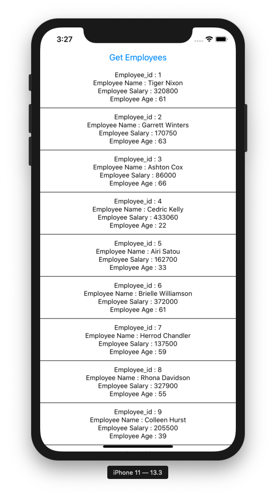

# rtk-createasyncthunk

*Readme last updated April 3rd, 2020*

A React Native Typescript app that explores Redux Tool Kit (RTK) v1.3's createAsyncThunk API

You can read about this new API on redux-toolkit's [v1.3 release notes](https://github.com/reduxjs/redux-toolkit/releases/tag/v1.3.0).

This repo has proven to run on node v13.10.1 and Cocopods v1.9.1

After cloning this repo, do the following to see the app in action:

```
$ cd {clone-repo}/myTSReduxApp
$ yarn install
$ npx react-native run-ios

```

Then press the "Get Employees" button and you'll see this displayed:




## How this app was generated

(You don't need to execute these steps)

```
$ npx react-native init myRTKApp --template react-native-template-typescript
$ yarn add @reduxjs/toolkit react-redux @types/react-redux axios
```